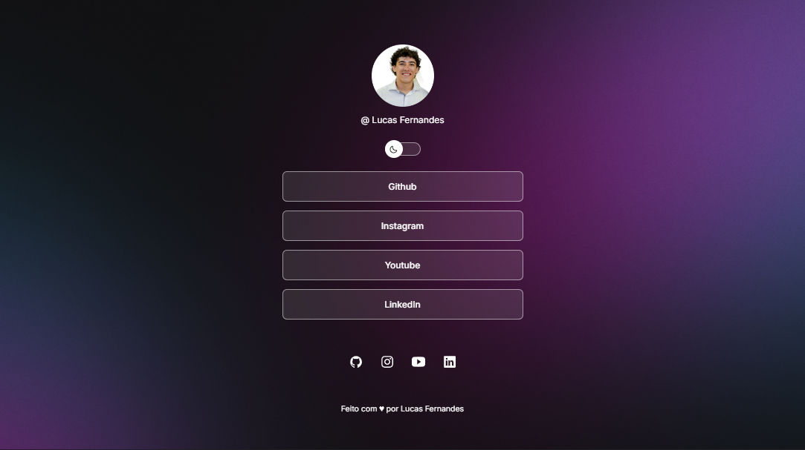
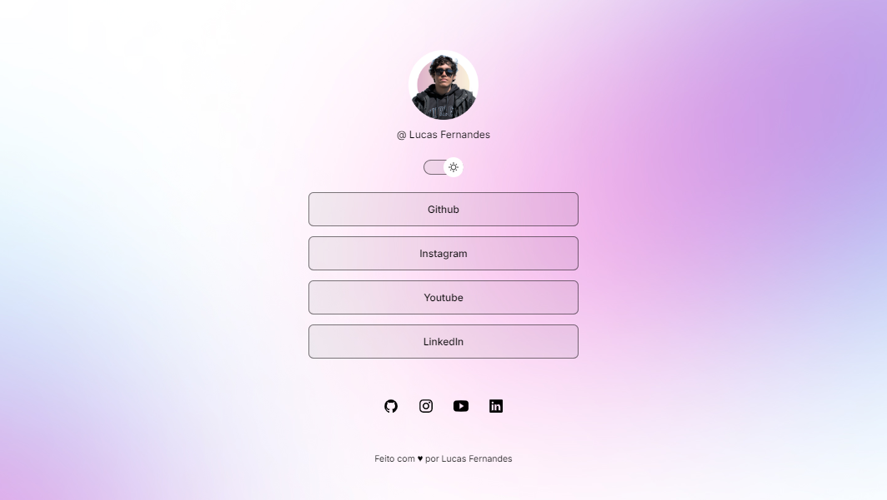

<h1 align="center"> Link aggregator </h1>

The link aggregator is an extension of your Instagram bio and other content or sales channels. In a single link, you can add all public contact networks and with just one click take potential customers to you.

  <a href="#Technologies">Technologies</a>&nbsp;&nbsp;&nbsp;|&nbsp;&nbsp;&nbsp;
  <a href="#Project">Project</a>&nbsp;&nbsp;&nbsp;|&nbsp;&nbsp;&nbsp;
  <a href="#Link-to-view">Link to view</a>&nbsp;&nbsp;&nbsp;|&nbsp;&nbsp;&nbsp;
  <a href="#memo-license">License</a>

  

  
<h1 align="center">
  
</h1>

<h1 align="center">
  
</h1>

  
<h2 align="left" id="Technologies"> &nbsp;&nbsp;   Technologies </h2> 

This project was developed with the following technologies:
- [HTML]
- [CSS]
- [JavaScript]
- [Git and Github]

  
<h2 align="left" id="Project"> &nbsp;&nbsp;   Project </h2>

  - Tool that allows you to bring together several links on a single page, facilitating access to different content  
  - It has dark mode and light mode, making the change with just one click interactively  
  - Profile photo changes along with the screen mode  
  - Responsive design, better user experiencee  
  - Project developed during the Full-stack Training course via the platform [Rocketseat](https://app.rocketseat.com.br)  

  
<h2 align="left" id="Link-to-view"> &nbsp;&nbsp;   Link to view </h2>

[Links agreggator](https://lucasfernandesm.github.io/Link-Aggregator-App/)

  
## :memo: License

This project is under the MIT license.

---
